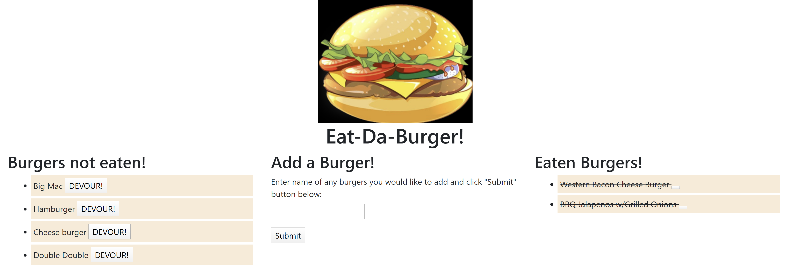

# Eat-Da-Burger!

#### Purpose

The purpose of this homework assignment is to learn about the MVC functionality and create a web application that allows use to add any types of burger they like, and once clicked devoured, it will be shown on devour burger section with a line-through style to indicate that it has been devoured.

#### Functionality

The functionality of this project is to allow users to add as many burger as they want and at the same time be able to manipulate the data they added with devoured button. The MVC style allowed us to be more organized with our codes, while making it easier to edits and find errors. 

#### Link to deployed Heroku: https://ductran963.github.io/weatherForecast/

#### Eat Da Burger website image:

